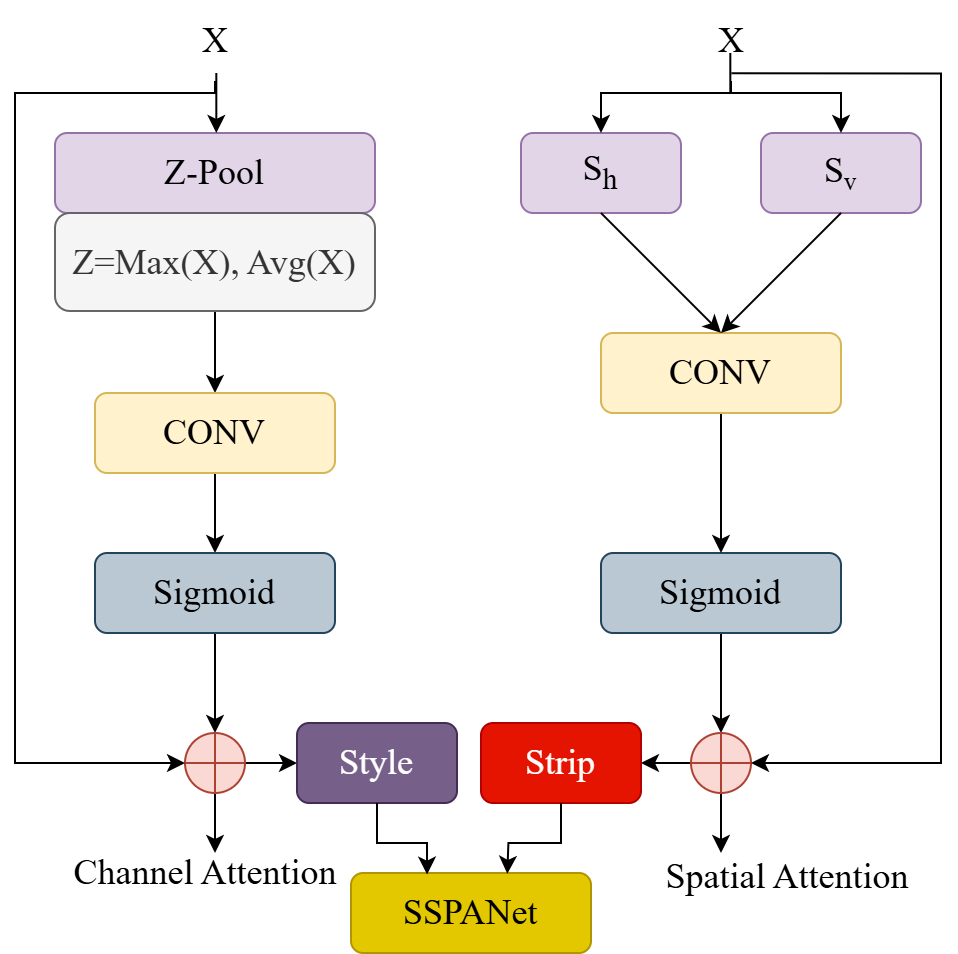

# Enhancing Brain Tumor Classification with SSPANet

This repository contains the official implementation of the paper:  
**"Enhancing brain tumor classification with a novel attention-based explainable deep learning framework"**  
Published in *Biomedical Signal Processing and Control*, Elsevier, 2026.  
DOI: [10.1016/j.bspc.2025.108636](https://doi.org/10.1016/j.bspc.2025.108636)

##  Project Page

You can explore a full overview of **SSPANet** (explanations, visuals, experiments) on the project webpage:  
[SSPANet Project Page](https://hellojahid.github.io/paper/sspanet/sspanet.html)


---

## Overview
Accurate and early detection of brain tumors from MRI scans is critical for patient outcomes, yet most deep learning (DL) models act as black boxes with limited clinical trust. To address this, we propose the **Strip-Style Pooling Attention Network (SSPANet)** — a lightweight, explainable attention mechanism that enhances both classification accuracy and interpretability in brain tumor diagnosis.

SSPANet combines **Z-pool channel attention**, **strip pooling for long-range spatial context**, and **style pooling for fine-grained texture awareness**. Integrated with CNN backbones (VGG16 and ResNet50), it delivers state-of-the-art results while producing clear visual explanations through **GradCAM, GradCAM++, and EigenGradCAM**.

---

## SSPANet Architecture

The structural diagram of the proposed **SSPANet** attention mechanism is shown below:

<p align="center">
  
</p>

*Fig. Structural diagram of proposed SSPANet, combining Z-Pool channel attention with strip and style pooling spatial attention.*

---

## Key Contributions
- **SSPANet attention module**: Fuses channel, spatial, and style cues for robust feature refinement.
- **Z-pool channel attention**: Uses both average and max pooling for richer statistics.
- **Strip and style pooling**: Captures directional context and texture information often missed by prior methods.
- **Explainable predictions**: GradCAM variants show precise tumor localization and boundary clarity.
- **State-of-the-art performance**: Achieves 97% accuracy, precision, recall, and F1-score with ResNet50 + SSPANet, along with 95% Cohen’s Kappa and MCC.

---

## Dataset
Experiments are conducted on the **Figshare Brain Tumor Dataset**:
- 3,064 T1-weighted contrast-enhanced MRI images  
- 233 patients, three tumor classes: *Meningioma, Glioma, Pituitary*  
- Split: 80% training, 10% validation, 10% testing  

---

## Methodology
1. **Preprocessing**: MRI slices are normalised and partitioned into train/val/test sets.  
2. **Backbones**: VGG16 and ResNet50 CNN architectures.  
3. **Attention modules**: Comparative study of SSPANet against SE, CBAM, Coordinate Attention, SPNet, SRMNet, and GCNet.  
4. **Explainability**: Visual inspection with GradCAM, GradCAM++, and EigenGradCAM to highlight decision-relevant regions.  
5. **Evaluation metrics**: Accuracy, Precision, Recall, F1, Cohen’s Kappa, Matthews Correlation Coefficient.  

---

## Results
| Model                | Accuracy | Precision | Recall | F1 | Kappa | MCC |
|-----------------------|----------|-----------|--------|----|-------|-----|
| **VGG16**             | 0.89     | 0.89      | 0.89   | 0.89 | 0.82  | 0.82 |
| **VGG16 + SSPANet**   | **0.93** | **0.93**  | **0.93** | **0.93** | **0.88** | **0.89** |
| **ResNet50**          | 0.90     | 0.90      | 0.90   | 0.90 | 0.83  | 0.83 |
| **ResNet50 + SSPANet**| **0.97** | **0.97**  | **0.97** | **0.97** | **0.95** | **0.95** |

- SSPANet consistently outperforms existing attention mechanisms.  
- Visualizations show sharper, noise-free tumor localization compared to baselines.  

---

<!-- ## Installation & Usage
```bash
# clone repo
git clone https://github.com/YourUsername/SSPANet-BrainTumor.git
cd SSPANet-BrainTumor

# create environment
pip install -r requirements.txt -->
